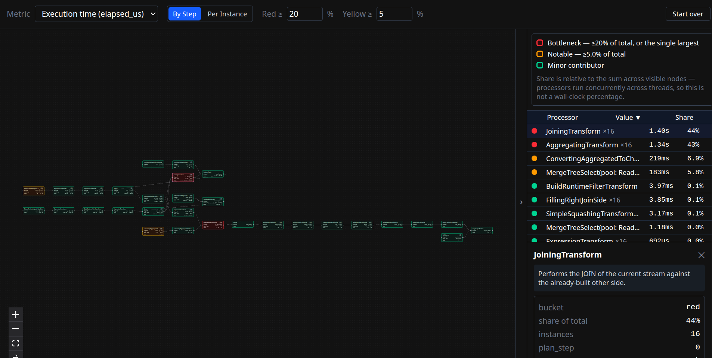
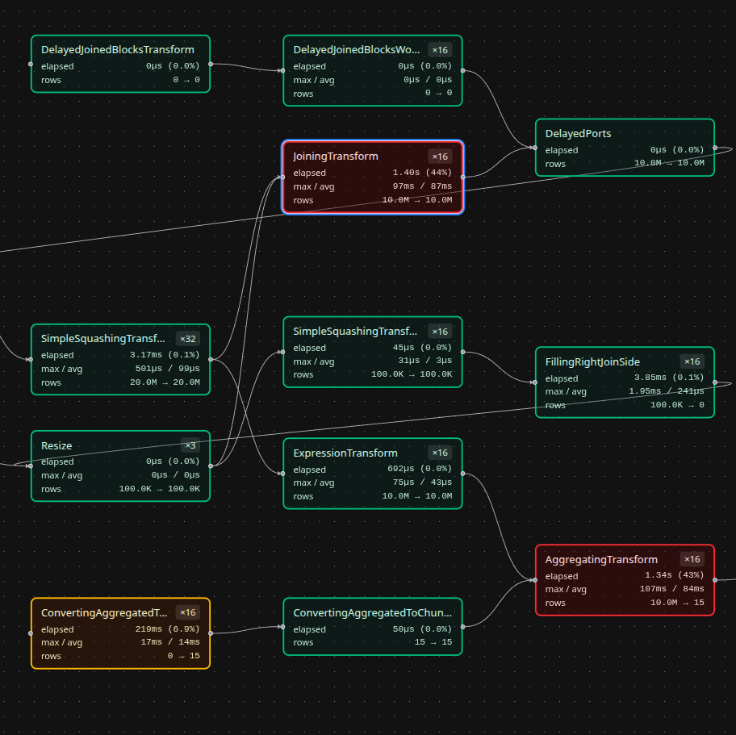

# scruta

**See exactly where your ClickHouse query spent its time.**

`system.processors_profile_log` records every processor ClickHouse's query
pipeline ran — but as a table, it's just rows. `parent_ids` encode a whole
execution graph, and finding the one processor eating 80% of your query's
time means squinting at a CSV and doing the math yourself.

scruta turns that table into the graph it's secretly describing: paste the
CSV, get an interactive pipeline diagram with the slow part already colored
red.



## Why

- **Paste and go.** No connecting to your cluster, no server, no account.
  One `SELECT ... FORMAT CSVWithNames`, pasted into a textarea.
- **It finds the bottleneck for you.** Every processor is ranked by its
  share of the query's execution time (or wait time, or row/byte
  throughput) and colored accordingly — red means "look here first."
- **It explains what it's showing you.** Click any processor and get a
  plain-English description of what that ClickHouse internal actually
  does, pulled straight from ClickHouse's own source — useful the first
  time you see `MergeTreeSelect(pool: PrefetchedReadPool, algorithm: Thread)`
  and wonder what on earth that is.
- **Nothing leaves your browser.** Parsing and rendering are entirely
  client-side. Profile data can carry sensitive table/column names — this
  tool never sends it anywhere.

## What a bottleneck actually looks like



Here, `JoiningTransform` and `AggregatingTransform` are together eating
87% of this query's processor time across their 16 parallel threads —
immediately obvious from the graph, considerably less obvious from 200+
raw CSV rows.

## Getting the input CSV

Run this in ClickHouse for the query you want to inspect, and paste the
output into the app:

```sql
SELECT *
FROM system.processors_profile_log
WHERE query_id = '<id>'
FORMAT CSVWithNames
```

## Running locally

Requires Node 20 (or 22.12+).

```bash
npm install
npm run dev
```

This starts the Vite dev server (defaults to http://localhost:5173/) with
hot module reloading.

Other scripts:

```bash
npm run build    # type-check and produce a production build in dist/
npm run preview  # serve the production build locally
npm run lint     # run oxlint
```

See `specification.md` for the full design spec.

---

*scruta* — Latin, "you search/examine closely." Seemed appropriate.
